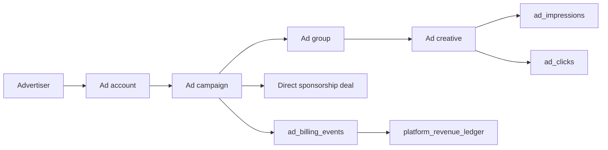

# Vuqiro ads platform

How advertising works end to end: entities, lifecycle, serving, billing,
self-serve, sponsorships and reporting. Complements
`docs/architecture/ads-platform.md` (original design notes).

## Entities

- **Advertiser** — the brand. `status` gates all delivery. `owner_profile_id`
  links a platform user for the self-serve portal (set by an admin).
- **Ad account** — billing container per advertiser.
- **Campaign** — objective (`awareness/traffic/conversions/installs`), buying
  type (`cpm/cpc/cpa/fixed_sponsorship`), total + daily budgets, schedule,
  status (`draft → pending_review → active ⇄ paused → completed`, or
  `rejected`).
- **Ad group** — placements (`feed/discover/profile/inbox/post_roll`),
  targeting jsonb (countries, languages, interests, min age), per-viewer daily
  frequency cap.
- **Creative** — card/image/video with CTA; `review_status` must be
  `approved` before it can serve. Every served unit carries the advertiser
  name and is rendered with a "Sponsored" label by clients.

## Serving rules (`apps/api/src/lib/adServing.ts`)

An ad can serve only when **all** of these hold:

1. Campaign `active`, inside its schedule window.
2. Total budget not exhausted (`spent_cents < total_budget_cents`).
3. **Daily pacing**: if `daily_budget_cents` is set, today's
   `ad_billing_events` for the campaign are below it (spend resumes the next
   day).
4. Advertiser `active`.
5. Ad group `active` and sold for the requested placement.
6. Targeting matches: country/language contextual; **interest targeting only
   for viewers who opted in to personalized ads**.
7. Viewer's per-campaign daily frequency cap not exceeded
   (`ad_frequency_caps`).
8. Creative `approved` + `active`.

Feed insertion happens server-side in `/feed/for-you`: one ad after every
`adFrequency` organic items, at most `maxAdsPerPage` per page (both
superadmin-tunable in `platform_settings.feed`).

## Billing and revenue

- **CPM**: impressions reconcile into `ad_billing_events` deltas
  (`impression_charge`, idempotent per spend level) and mirror into
  `platform_revenue_ledger` (`ad_revenue`).
- **CPC**: each click books a `click_charge` (idempotent per click id).
- **Fixed sponsorships**: activating a deal books the full fixed price as
  platform revenue + a `fixed_fee` billing event (idempotent per deal).
- Ledgers are append-only; `spent_cents` on the campaign is a maintained
  denormalization.

## Impressions and clicks

- Clients call `POST /ads/impression` when the viewability threshold is met
  (ad card active in the viewport) and `POST /ads/click` on CTA taps.
- Both endpoints resolve the creative server-side; billing and frequency-cap
  bumps never trust client-provided campaign data.
- Users can report ads (`POST /ads/report`) → moderation.

## Self-serve advertiser portal

- An admin links a platform user via `advertisers.owner_profile_id`
  (advertiser create/edit form, or API `ownerProfileId`).
- The owner signs into the **advertiser portal** (`/advertiser` route in the
  admin app deployment — separate shell, non-admin auth) and can:
  - see their advertisers, ad accounts, campaigns and delivery reporting;
  - create **draft** campaigns (min budget $10; CPM/CPC prices are set by the
    platform, not the advertiser);
  - submit drafts for review, pause/resume active campaigns.
- Owners can never activate, reject or complete campaigns; review/activation
  stays with Vuqiro admins (`/ads/campaigns` console). API scoping is
  enforced server-side on every `/advertiser/*` route — an advertiser can
  never read another advertiser's data.

## Manual sponsor deals (superadmin)

`/ads/sponsorships` console: create a deal (fixed price, period, invoice
reference), activate it (books revenue idempotently), complete it. Deals can
link to a campaign whose creatives run in-feed with the standard "Sponsored"
label. Payment state is tracked via the invoice reference + ledger; every
action is audit-logged.

## Boosted organic videos

Creators boost their own videos with coins (`boost_campaigns`). Boosts:

- multiply ranking score through the `boost` factor — but **only** for
  moderation-visible, safe, unreported content (paid reach can never bypass
  moderation);
- are disclosed: feed responses set `promoted: true` on actively boosted
  videos and clients render a "Promoted" badge.

## Reporting and exports

- Admin console: `/ads/reporting` (impressions, clicks, CTR, conversions,
  spend per campaign) + billing events + user ad reports.
- CSV exports (admin/finance): campaign report, platform revenue ledger,
  creator revenue ledger — via the `format=csv` query parameter on the API or
  the export buttons in the console (`/api/export/*` proxy).
- Advertiser portal shows the same per-campaign metrics scoped to owned
  campaigns.

## Superadmin controls

| Control | Where |
|---|---|
| Ad frequency / max per page | `/settings` → `feed` |
| Review campaigns/creatives | `/ads/campaigns`, `/ads/creatives` |
| Suspend advertisers | `/ads/advertisers` |
| Sponsor deals + invoicing | `/ads/sponsorships` |
| Ad-eligibility per video | `/videos` (ad-eligible toggle) |
| Frequency caps per group | `/ads/creatives` (group settings) |
| Revenue oversight | `/monetization/revenue` + CSV exports |
