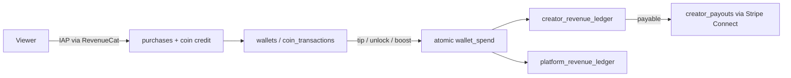

# Creator monetization

How creators earn on Vuqiro, how money is tracked, and how payouts work.
Related: `docs/architecture/stripe-connect-payouts.md`,
`docs/architecture/revenuecat-mapping.md`, `docs/product/monetization-model.md`.

## Revenue sources

| Source | Mechanism | Ledger `source` |
|---|---|---|
| Coin tips | Viewers spend coins (`/wallet/tip`) | `tip` |
| Coin unlocks | Pay-per-video (`unlock_with_coins` visibility) | `unlock` |
| Memberships | RevenueCat subscriptions attributed via `intended_creator` | `subscription` |
| Sponsor deals | Platform-sold deals that feature a creator (manual) | `sponsorship` |
| Ad revenue share | Foundation present (ledger source), payout rules owner-defined | `ad_share` |

## Money flow

- Coins only move through the atomic SQL functions (`wallet_spend`,
  `wallet_credit`, `wallet_reverse`) with idempotency keys — no direct
  balance writes anywhere.
- Every earning is a **ledger row** (`creator_revenue_ledger`) with gross,
  platform fee and net amounts — totals are always derivable, never stored
  alone.
- **Estimated vs finalized**: ledger `status` walks
  `pending → payable → paid` (or `held`). Dashboards show pending and payable
  separately; payouts only ever draw from `payable`.

## Eligibility and setup

1. User switches to a creator account (`/creators/onboard`).
2. Admin verification (`/admin/creators/:id/verify`) and monetization
   enablement (`enable-monetization`) — both audit-logged.
3. Payout onboarding via Stripe Connect (`POST /payouts/onboarding` →
   hosted onboarding; KYC/tax handled by Stripe). Status tracked on
   `creator_payout_accounts`.

## Creator-facing surfaces (mobile studio)

- **Earnings dashboard** (`/studio`): views, watch time, followers gained,
  tips, unlock revenue, subscription revenue, pending vs paid.
- **Payouts** (`/studio/payouts`): payable/pending/held balances, payout
  history with failure reasons, minimum payout ($25 default).
- **Subscribers** (`/studio/subscribers`): totals by tier, recent members.

## Platform controls (admin)

- Payout batches: `POST /admin/payouts/batch` (superadmin/finance) creates
  idempotent Stripe transfers for payable balances above the minimum.
- Holds: `POST /admin/payouts/:id/hold` / `release` — used by moderation and
  fraud workflows (`payout_holds`); all changes audit-logged.
- Manual wallet adjustments route through the atomic functions and are
  audit-logged (`/admin/wallet/adjust`).
- Revenue oversight: creator + platform ledgers with CSV export
  (`/monetization/revenue`).
- Fee configuration: package price versions define fee splits
  (`/monetization/price-versions`).

## Safety rules

- No payouts on unverified accounts or held balances.
- Estimated numbers are never payable; only finalized ledger rows count.
- Fraud signals (chargeback risk, engagement anomalies) can hold payouts
  pending review.
- Every payout state change is audit-logged and idempotent
  (`creator_payouts.idempotency_key`).
