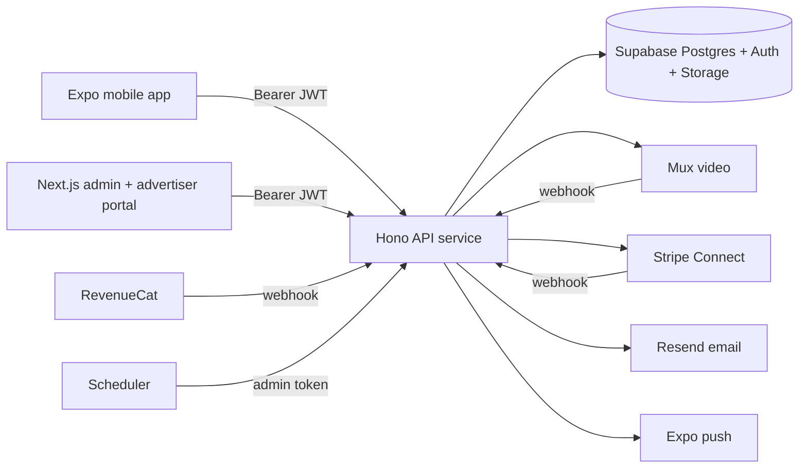

# Deployment guide

How to take Vuqiro from this repository to a running production stack.
Operational runbooks: `docs/architecture/operations.md`. Final gate:
`docs/launch-checklist.md`.

## Topology

## 1. Database (Supabase)

1. Create a production Supabase project.
2. Apply migrations: `supabase db push` (or run `supabase/migrations/*.sql`
   in order). Never run `supabase/seed/seed.sql` against production.
3. Bootstrap the first superadmin:
   - create the auth user (Supabase dashboard → Authentication),
   - insert the admin row:
     `insert into public.admin_users (auth_user_id, email, display_name, role) values ('<auth uuid>', 'you@company.com', 'Your Name', 'platform_superadmin');`
4. Storage buckets are created by the storage migration (`avatars`,
   `thumbnails`, `ad-creatives`, `report-evidence`, `legal-exports`,
   `admin-assets`). Verify they exist with the expected policies.
5. Enable Point-in-Time Recovery and configure backups.

## 2. API service (`apps/api`)

- Any Node 20+ host (container, Fly, Railway, ECS…). Start:
  `pnpm --filter api start` (or `tsx src/server.ts`). Port: `API_PORT`.
- Set every variable from `docs/env.md`. The process refuses to boot in
  production with missing critical providers — read the error output; it
  lists exactly what is missing.
- Put it behind TLS; the API emits HSTS in production.
- Health probes: `GET /health` (shallow, fast) and `GET /health?deep=1`
  (pings providers; used by the admin Integration health page).

## 3. Admin console + advertiser portal (`apps/admin`)

- `pnpm --filter admin build` → deploy the Next.js output (Vercel or Node
  host). Required env: `NEXT_PUBLIC_SUPABASE_URL`,
  `NEXT_PUBLIC_SUPABASE_ANON_KEY`, `NEXT_PUBLIC_API_URL`.
- Add the deployed origin to the API's `CORS_ORIGINS`.
- The advertiser portal ships at `/advertiser` on the same deployment with
  its own (non-admin) auth.

## 4. Mobile app (`apps/mobile`)

- EAS builds: see `docs/implementation/eas-builds.md`. Required build env:
  `EXPO_PUBLIC_APP_ENV=production`, `EXPO_PUBLIC_API_URL`,
  `EXPO_PUBLIC_SUPABASE_URL`, `EXPO_PUBLIC_SUPABASE_ANON_KEY`, RevenueCat
  public keys, optional `EXPO_PUBLIC_SENTRY_DSN`.
- Store submission: `docs/app-store/`.

## 5. Providers

| Provider | Setup |
|---|---|
| **Mux** | Create env + API token, webhook to `https://<api>/video-provider/webhook` with `VIDEO_WEBHOOK_SECRET`; optional signing key pair for signed playback. |
| **RevenueCat** | Project + store apps, products/offerings per `docs/architecture/revenuecat-mapping.md`, webhook to `/revenuecat/webhook` with the shared secret. |
| **Stripe** | Account + Connect, webhook to `/stripe/webhook`, secrets in env. |
| **Expo push** | `PUSH_PROVIDER=expo`; optional `EXPO_ACCESS_TOKEN`. |
| **Resend** | Verified domain + API key; `EMAIL_PROVIDER=resend`, `EMAIL_FROM`. |
| **Sentry** | DSNs for API and mobile. |

## 6. Scheduled jobs

Point any scheduler (cron, GitHub Actions, Supabase cron + HTTP) at these
admin endpoints using a superadmin/admin token:

| Job | Endpoint | Suggested cadence |
|---|---|---|
| Notification delivery | `POST /admin/notifications/process-jobs` | every 1–5 min |
| Trending snapshots | `POST /admin/ops/trending/run` (`{"window":"daily"}`) | hourly or daily |
| Analytics rollup | `POST /admin/ops/analytics/run` | daily after UTC midnight |
| Privacy workers | `POST /admin/ops/privacy/run` | daily |

All runs are audit-logged and can also be triggered manually from the admin
Integration health page.

## 7. Post-deploy verification

1. `GET /health?deep=1` → all providers `ok`.
2. Sign in to the admin console; Integration health shows live statuses.
3. Create a test account in the app: onboarding → feed → follow → comment.
4. Upload a short video; confirm the Mux webhook advances it to `ready`.
5. Sandbox purchase (RevenueCat) credits coins; tip a creator; check ledgers.
6. Run through `docs/launch-checklist.md` before opening to the public.
